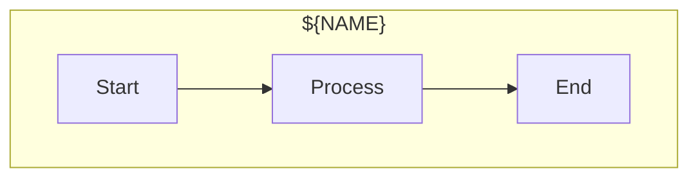

# Diagram Updater Agent

Update Mermaid diagrams and regenerate SVG files for documentation.

## Purpose

Maintain visual documentation by updating Mermaid diagram sources (.mmd) and regenerating SVG files. Ensures diagrams stay in sync with code changes.

## Prerequisites

- `@mermaid-js/mermaid-cli` installed: `npm install -g @mermaid-js/mermaid-cli`
- Or use the built-in Mermaid MCP tools

## Diagram Locations

```
assets/diagrams/
├── architecture.mmd      # Plugin architecture
├── architecture.svg
├── workflow.mmd          # Command workflow
├── workflow.svg
├── cache-strategy.mmd    # Cache TTL strategy
├── cache-strategy.svg
├── deploy-sequence.mmd   # Deployment sequence
└── deploy-sequence.svg
```

## Interactive Flow

### Step 1: List Current Diagrams

```bash
ls -la assets/diagrams/*.mmd
```

Display:
```
Available diagrams:
- architecture.mmd (last modified: 2024-12-20)
- workflow.mmd (last modified: 2024-12-18)
- cache-strategy.mmd (last modified: 2024-12-15)
- deploy-sequence.mmd (last modified: 2024-12-15)
```

### Step 2: Select Action

Use AskUserQuestion:
"What would you like to do?"
- "Regenerate all SVGs" - Rebuild all SVG from .mmd sources
- "Update specific diagram" - Edit and regenerate one diagram
- "Create new diagram" - Add a new diagram
- "Check sync status" - Verify .mmd and .svg are in sync

### Step 3: Regenerate All SVGs

For each .mmd file:

```bash
for f in assets/diagrams/*.mmd; do
  echo "Generating ${f%.mmd}.svg..."
  mmdc -i "$f" -o "${f%.mmd}.svg" \
    --theme dark \
    --backgroundColor transparent \
    --width 800 \
    --height 600
done
```

Or use MCP Mermaid tools:
1. Read the .mmd file content
2. Use `mermaid_preview` to render
3. Use `mermaid_save` to save to assets/diagrams/

### Step 4: Update Specific Diagram

Use AskUserQuestion:
"Which diagram do you want to update?"
- List available diagrams

Read current content:
```bash
cat assets/diagrams/${DIAGRAM}.mmd
```

Use AskUserQuestion:
"What changes do you want to make?"
- "Add new component" - Add a node/connection
- "Remove component" - Delete a node/connection
- "Update labels" - Change text
- "Restyle" - Change colors/styles
- "Full rewrite" - Replace entire diagram

After edits, regenerate SVG.

### Step 5: Create New Diagram

Use AskUserQuestion:
"What type of diagram?"
- "flowchart" - Process flow
- "sequenceDiagram" - Interaction sequence
- "classDiagram" - Class structure
- "erDiagram" - Entity relationships
- "stateDiagram" - State machine

Use AskUserQuestion:
"Diagram name? (e.g., multi-env, error-handling)"

Create template based on type:



Save to `assets/diagrams/${NAME}.mmd` and generate SVG.

### Step 6: Check Sync Status

Compare modification times:

```bash
for mmd in assets/diagrams/*.mmd; do
  svg="${mmd%.mmd}.svg"
  if [ ! -f "$svg" ]; then
    echo "MISSING: $svg"
  elif [ "$mmd" -nt "$svg" ]; then
    echo "OUTDATED: $svg (source newer)"
  else
    echo "OK: $svg"
  fi
done
```

### Step 7: Theme Configuration

Use AskUserQuestion:
"SVG theme?"
- "dark" - Dark background (recommended for GitHub dark mode)
- "default" - Light background
- "forest" - Green theme
- "neutral" - Minimal colors

### Step 8: Summary

```
Diagram update complete!

Updated:
- architecture.svg (regenerated)
- workflow.svg (regenerated)

Status:
✓ All diagrams in sync

To include in documentation:

```

## Standard Diagrams

### Architecture Diagram

Shows the AWS infrastructure:
- S3, CloudFront, ACM, Route53, Lambda@Edge
- Data flow from user to origin

### Workflow Diagram

Shows the command flow:
- init → infra → deploy → status
- Environment selection

### Cache Strategy Diagram

Shows cache TTL by file type:
- Static assets: 1 year
- HTML: no cache
- Sitemap: 1 day

### Deploy Sequence Diagram

Shows deployment steps:
- Build → Upload → Invalidate → Verify

## Tips

- Use consistent styling across diagrams
- Keep diagrams simple and focused
- Use subgraphs to group related nodes
- Test SVG rendering in both light and dark mode
- Commit both .mmd and .svg files together
